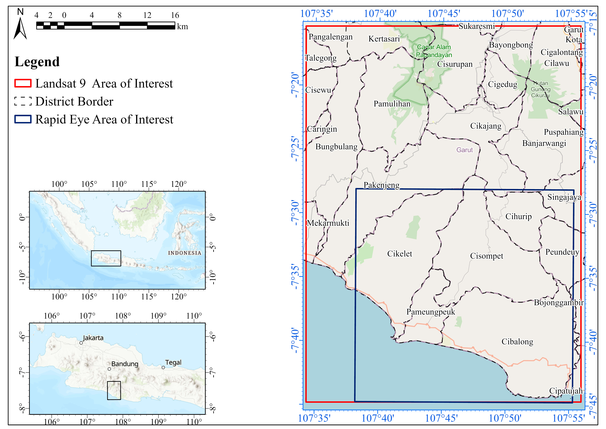
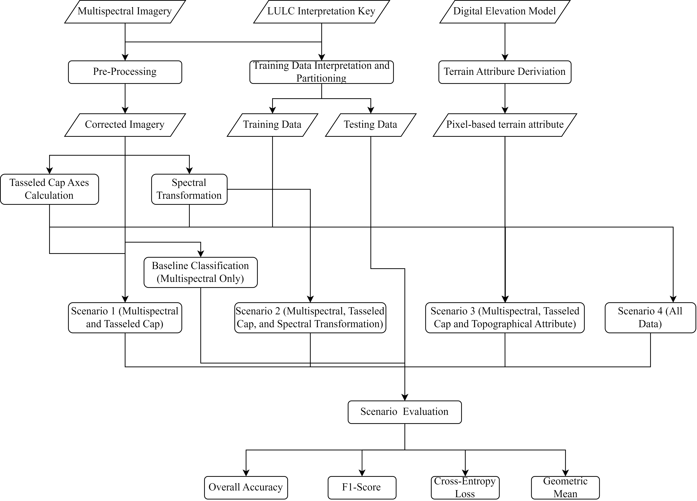

# Exploring Various Scenarios of Tasseled Cap Transformation Integration for Detailed Land Cover Land Use Classification 

## Overview
This is the scripts for conducted Land Cover Land Use (LULC) Classification using Extreme Gradient Boosing Classifiers. This classification is part of my master's thesis project, which explored the capability of Tasselled Cap Transformation (TCT) for detailed LULC mapping. This study is conducted since previous literature has explored the capability of TCT in improving LULC classification accuracy. However, noticeble research gap persist, especially in the detailed nature of the classification. Therefore,  this study conducted the classification while using a detailed classification scheme, namely Indonesia's Official CLassification scheme (SNI 2014). This research is conducted using two different data, namely
Landsat-9 and Rapid Eye, representing medium and high-resolution imagery, respectively.
## Location
This study is conducted in Southern Part of Garut Regency, West Java Province, Indonesia. The northern part of the study location contains volcanic landforms, characterized by active and dormant volcanos (Papandayan and Cikuray mountain). The center part of the location is predominantly structural and denudational landforms, indicated by various mountain ranges and hills. The southern part of the location, were flat lowland, with mixed landforms of aeolian, marine, and fluvial landforms. The area of interest (AOI) is shown in the figure below. The red box bounds the Landsat AOI while the blue box bounds the Rapid Eye AOI.

  

## Data Source and Classification Scenario
The classification using original multispectral bands will be used as benchmark for assessing the increase or decrease in model accuracy of the integration scenarios. Four scenarios of TCT integration in the multispectral classification were evaluated in this study. The scenarios for the tasseled cap integration are as follows: 
 
Scenario 1: The classification using multispectral bands and TCT transformation.  
Scenario 2: The classification using multispectral bands, TCT, and spectral transformation.  
Scenario 3: The classification using multispectral bands, TCT, and topographical attribute.  
Scenario 4: will be conducted using TCT, and spectral transformation, and topographical data.  

The following table summarizes the feature sets for each integration scenario, which incorporate multispectral bands, TCT, topographical data, and spectral indices.

| Group                | Landsat-9           | RapidEye            | Reference                          |
|----------------------|---------------------|---------------------|------------------------------------|
| **Multispectral Bands** |                     |                     |                                    |
|                      | B1: Coastal Aerosol | B1: Blue            |                                    |
|                      | B2: Blue            | B2: Green           |                                    |
|                      | B3: Green           | B3: Red             |                                    |
|                      | B4: Red             | B4: Red-Edge        |                                    |
|                      | B5: NIR             | B5: NIR             |                                    |
|                      | B6: SWIR 1          | -                   |                                    |
|                      | B7: SWIR 2          | -                   |                                    |
|                      | B10: Thermal IR     | -                   |                                    |
| **Tasseled Cap**     | B: Brightness       | B: Brightness       | Schönert et al., 2014; Zhai et al. |
|                      | G: Greenness        | G: Greenness        |                                    |
|                      | W: Wetness          | Y: Yellowness       |                                    |
|                      | TCA: TCA            | TCA:                | Powell et al., 2010                |
| **Topographical**    | DEM: Elevation      | DEM:                |                                    |
|                      | Slope               | Slope               | Jordan, 2007                       |
|                      | Aspect              | Aspect              |                                    |
|                      | TPILF: Landform     | TPILF               | Guisan et al., 1999; Weiss, 2001   |
|                      | TWI: Wetness Index  | TWI                 | Beven & Kirkby, 1979               |
|                      | FA: Flow Accum.     | FA:                 |                                    |
| **Spectral Indices** | NDVI                | NDVIre              | Tucker, 1979; Zhang et al., 2017   |
|                      | EVI                 | GRNDVI              | Huete, 2012; Zhang et al., 2017    |
|                      | MNDWI               | NDWI                | McFeeters, 1996; Xu, 2006          | 
|                      | BUI                 | TCARI               | Haboudane et al., 2002; He et al.  |
|                      | AWEI                | -                   | Feyisa et al., 2014                |

## Workflow

  

